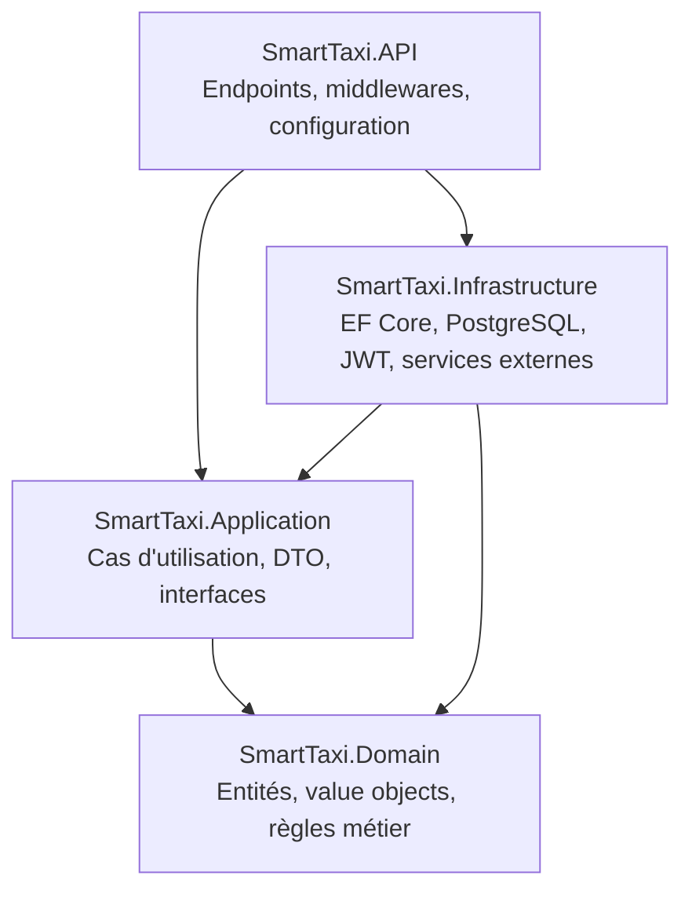

# SmartTaxi

## Présentation du projet

SmartTaxi est une plateforme de gestion de transport de type VTC/taxi conçue pour mettre en relation clients, chauffeurs, propriétaires de véhicules et prestataires de services associés (garages, assistance routière, annonceurs) au sein d'un écosystème unique.

Le projet est structuré en plusieurs applications autour d'un backend central, avec une approche architecturale rigoureuse (Clean Architecture, monolithe modulaire) et une démarche de sécurité intégrée progressivement (DevSecOps).

Ce document présente l'état actuel du projet à des fins de revue technique. Il décrit ce qui est en place et ce qui est prévu, sans anticiper de fonctionnalités non encore développées.

## Objectifs principaux

- Offrir une mise en relation fiable et sécurisée entre clients et chauffeurs.
- Centraliser la gestion des courses, des véhicules et de leur maintenance.
- Faciliter l'assistance routière en cas d'incident.
- Permettre aux propriétaires de véhicules de suivre leur flotte.
- Intégrer un système de fidélité (Rewards) pour les utilisateurs.
- Ouvrir un espace publicitaire pour des annonceurs tiers.
- Fournir aux administrateurs une supervision complète de la plateforme.
- Construire une base technique maintenable, testable et évolutive.

## Applications prévues

| Application | Public cible |
|---|---|
| Application client | Personnes souhaitant réserver une course |
| Application chauffeur | Chauffeurs assurant les courses |
| Application propriétaire | Propriétaires gérant leur flotte de véhicules |
| Application garage | Prestataires assurant la maintenance des véhicules |
| Application assistance routière | Prestataires d'intervention en cas de panne ou d'incident |
| Application annonceur | Annonceurs diffusant des campagnes publicitaires |
| Application administrateur | Équipe interne supervisant la plateforme |

## Technologies prévues

| Domaine | Technologie |
|---|---|
| Runtime backend | .NET 10 |
| Framework API | ASP.NET Core Web API |
| Architecture | Clean Architecture, monolithe modulaire |
| Persistance | PostgreSQL (prévu) |
| Accès aux données | Entity Framework Core (prévu) |
| Tests | xUnit (prévu) |
| Sécurité | Démarche DevSecOps progressive |

## Architecture Clean Architecture

Le backend suit les principes de la Clean Architecture : le cœur métier (Domain) ne dépend de rien, et chaque couche externe dépend uniquement des couches internes.



## Dépendances entre les projets

| Projet | Dépend de |
|---|---|
| SmartTaxi.Domain | Aucun |
| SmartTaxi.Application | SmartTaxi.Domain |
| SmartTaxi.Infrastructure | SmartTaxi.Application, SmartTaxi.Domain |
| SmartTaxi.API | SmartTaxi.Application, SmartTaxi.Infrastructure |

Ces dépendances sont vérifiées dans les fichiers `.csproj` de chaque projet et respectent le sens de dépendance imposé par la Clean Architecture.

Pour le détail de l'architecture, voir [docs/backend-architecture.md](docs/backend-architecture.md).

## Modules métier

- Identity
- Customers
- Drivers
- Rides
- Vehicles
- Maintenance
- RoadsideAssistance
- Payments
- Rewards
- Advertising
- Administration

Le détail de chaque module est disponible dans [docs/backend-modules.md](docs/backend-modules.md).

## Sécurité et DevSecOps

La démarche de sécurité est décrite dans [docs/devsecops-strategy.md](docs/devsecops-strategy.md), avec une distinction claire entre ce qui est déjà en place et ce qui est prévu.

## Étapes futures du développement

1. Mise en place du projet de tests xUnit et des premiers tests unitaires du Domain.
2. Intégration d'Entity Framework Core et configuration de la connexion PostgreSQL.
3. Implémentation progressive des modules métier, en commençant par Identity.
4. Mise en place de l'authentification et de l'autorisation (JWT).
5. Définition des premiers endpoints de l'API pour les modules prioritaires.
6. Mise en place du pipeline d'intégration continue (GitHub Actions).
7. Ajout progressif des contrôles de sécurité (analyse statique, dépendances, secrets).
8. Développement des applications clientes (Flutter/Web) consommant l'API.

## Structure du dépôt

```
SmartTaxi/
├── backend/                    # Solution .NET (Clean Architecture)
│   └── src/
│       ├── SmartTaxi.Domain/
│       ├── SmartTaxi.Application/
│       ├── SmartTaxi.Infrastructure/
│       └── SmartTaxi.API/
├── frontend/                   # Applications clientes (prévu)
├── devsecops/                  # Ressources DevSecOps (prévu)
├── figma/                      # Maquettes et ressources design
├── docs/                       # Documentation technique
│   ├── backend-architecture.md
│   ├── backend-modules.md
│   └── devsecops-strategy.md
└── README.md
```

## Commandes backend

Depuis le dossier `backend/` :

```bash
# Restaurer les dépendances
dotnet restore

# Compiler la solution
dotnet build

# Exécuter les tests (une fois le projet de tests xUnit ajouté)
dotnet test
```
