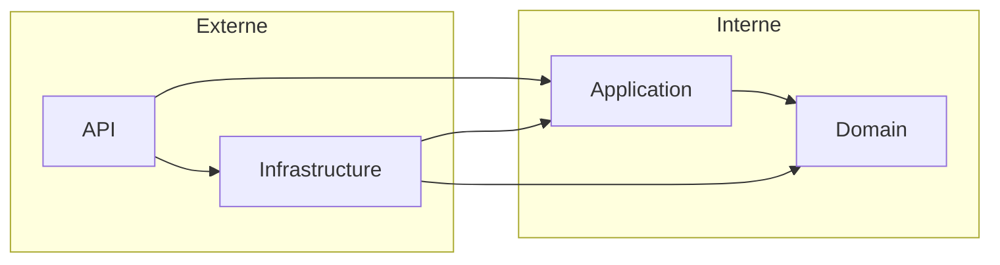
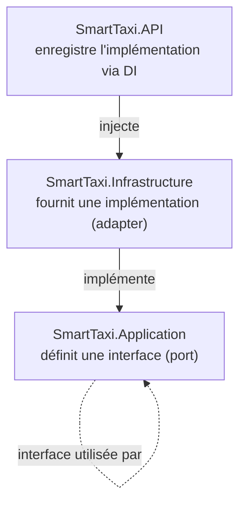
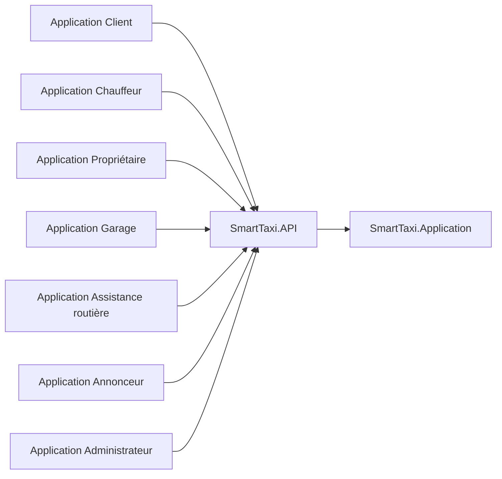
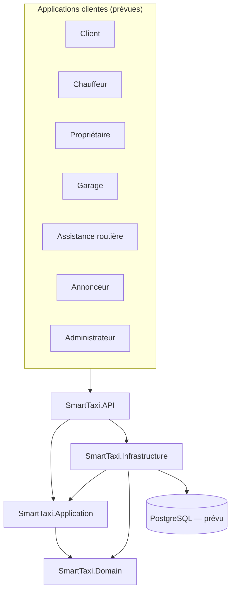

# Architecture backend — SmartTaxi

## 1. Objectif du document

Ce document décrit les choix architecturaux du backend SmartTaxi : Clean Architecture et monolithe modulaire. Il précise les responsabilités de chaque couche, les règles de dépendance, et la façon dont cette architecture est destinée à évoluer.

## 2. Choix de la Clean Architecture

La Clean Architecture organise le code en couches concentriques, où les dépendances pointent toujours vers l'intérieur (vers le Domain). Ce choix a été retenu pour :

- Isoler les règles métier de tout détail technique (base de données, framework web, services externes).
- Faciliter les tests unitaires du Domain et de l'Application sans dépendance à une infrastructure réelle.
- Permettre de remplacer une brique technique (par exemple le fournisseur de base de données) sans modifier le cœur métier.
- Rendre le système plus lisible pour de nouveaux contributeurs, chaque couche ayant une responsabilité claire.

## 3. Choix du monolithe modulaire

Plutôt qu'une architecture en microservices dès le départ, SmartTaxi adopte un monolithe modulaire : une seule application déployable, mais organisée en modules métier fortement cohérents et faiblement couplés entre eux.

Ce choix est motivé par :

- Une équipe de taille réduite, pour laquelle la complexité opérationnelle des microservices (déploiements multiples, communication réseau, cohérence des données distribuées) n'est pas justifiée à ce stade.
- Un déploiement et une supervision simplifiés le temps que le domaine métier se stabilise.
- La possibilité de conserver, à l'intérieur du monolithe, des frontières de modules claires qui faciliteraient une extraction future si le besoin apparaît.

## 4. Responsabilités des couches

### SmartTaxi.Domain

- Contient les entités, value objects, énumérations et événements de domaine.
- Porte les règles métier invariantes, indépendantes de toute technologie.
- Ne référence aucun autre projet de la solution.

### SmartTaxi.Application

- Contient les cas d'utilisation (use cases), DTO, commandes, requêtes et validations.
- Définit les interfaces (ports) que l'Infrastructure devra implémenter (par exemple des interfaces de repository ou de service externe).
- Dépend uniquement de SmartTaxi.Domain.

### SmartTaxi.Infrastructure

- Implémente les interfaces définies dans l'Application (repositories, services externes).
- Contient la configuration Entity Framework Core, l'accès à PostgreSQL, l'authentification JWT et les intégrations techniques.
- Dépend de SmartTaxi.Application et de SmartTaxi.Domain.

### SmartTaxi.API

- Expose les endpoints HTTP, les middlewares, la configuration et l'injection des dépendances.
- Ne contient aucune logique métier : elle orchestre les appels vers l'Application.
- Dépend de SmartTaxi.Application et de SmartTaxi.Infrastructure.

## 5. Règles de dépendance

Règle générale : une couche ne peut dépendre que des couches situées plus près du centre (Domain). Aucune dépendance circulaire n'est autorisée, et le Domain ne doit jamais dépendre d'une couche externe.

## 6. Principe d'inversion de dépendance

L'Application définit des interfaces (par exemple pour la persistance ou les services externes) sans connaître leur implémentation concrète. L'Infrastructure fournit ces implémentations et les enregistre via l'injection de dépendances configurée dans l'API.

Ainsi, l'Application ne dépend jamais directement d'Entity Framework Core, de PostgreSQL ou d'un service externe : elle dépend uniquement de ses propres abstractions.

## 7. Séparation entre logique métier et infrastructure

- Toute règle métier (calcul, validation métier, invariant) doit être portée par le Domain ou l'Application.
- L'Infrastructure ne doit contenir aucune règle métier : uniquement des détails techniques (requêtes EF Core, appels HTTP externes, génération de tokens, etc.).
- L'API reste un point d'entrée fin : elle traduit une requête HTTP en appel à un cas d'utilisation de l'Application, sans logique métier propre.

## 8. Communication future avec les applications clientes

Les applications Flutter et Web (client, chauffeur, propriétaire, garage, assistance routière, annonceur, administrateur) consommeront l'API via des appels HTTP(S), selon un contrat d'API à définir (REST, avec authentification JWT).

Cette communication n'est pas encore implémentée : elle constitue une étape future du projet.

## 9. Architecture logique globale

## 10. Avantages et limites

### Avantages

- Séparation claire des responsabilités entre métier et technique.
- Testabilité élevée du Domain et de l'Application, indépendamment de la base de données.
- Souplesse pour changer une brique technique sans impacter le métier.
- Organisation modulaire qui limite le couplage entre domaines métier (Rides, Payments, Drivers, etc.).

### Limites

- Complexité initiale plus importante qu'une architecture en couches simple, pour un projet démarrant.
- Nécessite une discipline constante pour éviter les dépendances non maîtrisées entre modules à l'intérieur du monolithe.
- Un monolithe modulaire, s'il n'est pas maintenu avec rigueur, peut progressivement perdre l'isolation entre ses modules.

## 11. Évolution possible

L'architecture actuelle n'exclut pas une évolution future vers des microservices si la charge, l'équipe ou les besoins d'isolement le justifient. Le découpage en modules métier cohérents (voir [docs/backend-modules.md](backend-modules.md)) est conçu pour faciliter une telle extraction si elle devenait nécessaire.

À ce stade, aucune décision n'est prise en faveur des microservices : le monolithe modulaire reste l'architecture cible pour la durée du projet en cours.
